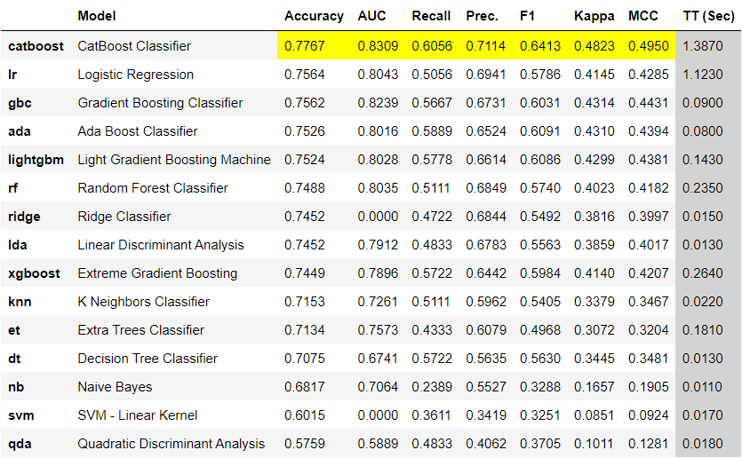
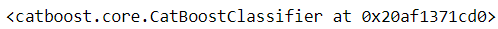
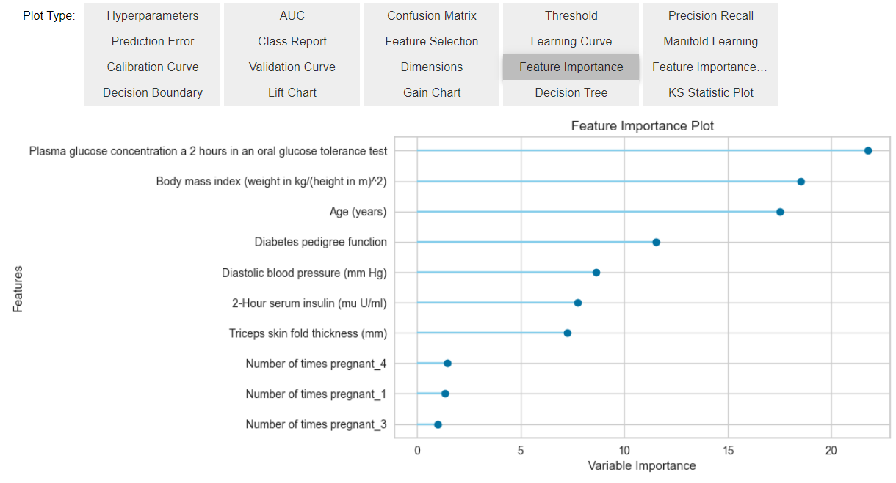
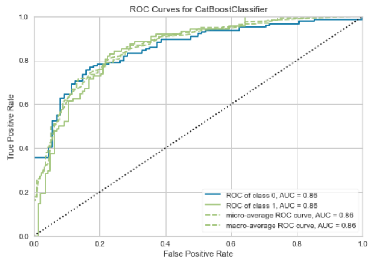
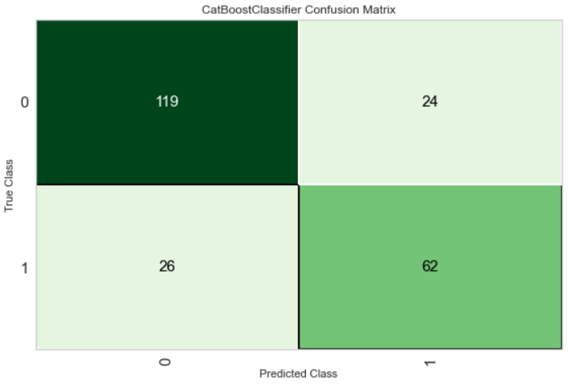
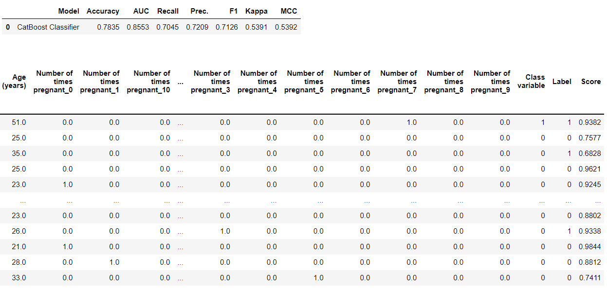
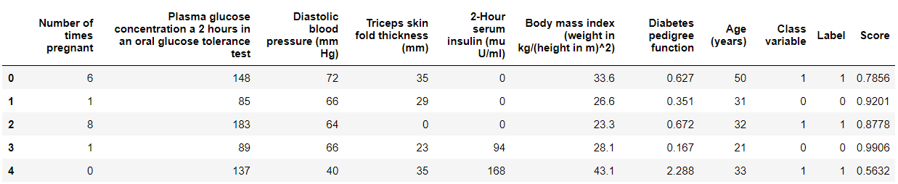
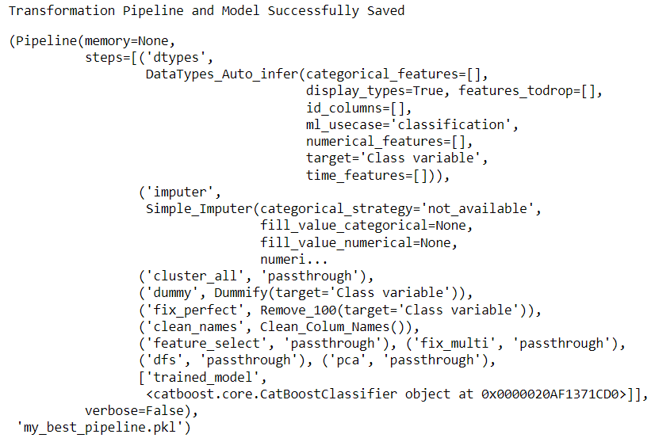
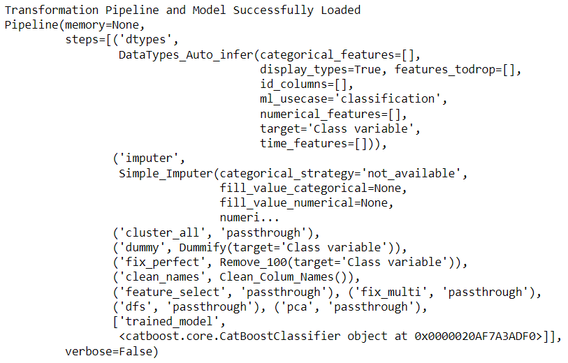

# PyCaret 中文教程

- 本教程是基于PyCaret2.3.6[官方文档](https://pycaret.readthedocs.io/en/latest/installation.html#installing-the-full-version)翻译

## Welcome to PyCaret

​		PyCaret是一个开源的低代码Python机器学习库，可以自动化机器学习工作流程。这是一个端到端的机器学习和模型管理工具，可以成倍地加快实验周期，提高效率。

​		与其他开源的机器学习库相比，PyCaret 是一款另类的低代码机器学习库，可以使用几行代码代替数百行代码，这可以使得实验速度和效率呈指数级增长。PyCaret 本质上是几个机器学习库与框架Python封装器，其中包含了scikit-learn, XGBoost, LightGBM, CatBoost, spaCy, Optuna, Hyperopt, Ray等等。

​		PyCaret 的设计和简单性受到公民数据科学家的新兴角色的启发，这是 Gartner 首次使用的术语；公民数据科学家是高级用户，他们可以执行以前需要更多技术专业知识的简单和中等复杂的分析任务。

引用说明：如果在研究或者论文中引用PyCaret，请按照以下格式：


```json
@Manual{PyCaret,
  author  = {Moez Ali},
  title   = {PyCaret: An open source, low-code machine learning library in Python},
  year    = {2020},
  month   = {April},
  note    = {PyCaret version 1.0.0},
  url     = {https://www.pycaret.org}
}
```


## 1. 安装

PyCaret 是在64-bit 系统上测试与支持的：

- Python 3.6 - 3.8
- Unbuntu 仅支持Python3.9
- Ubuntu >=16.04 
- Windows >=7

### 1.1 安装最新版本

为了避免和其他python库出现潜在冲突，建议创建虚拟环境使用PyCaret。创建步骤如下：

```python
# 直接使用python 创建环境
python -m venv env-name

# 激活环境
env-name path/Scripts> activate

# 使用conda创建环境
conda create --name env-name python=3.6.5

# 激活环境
conda activate env-name

# 环境创建之后，激活环境，然后设置notebook kernel
python -m ipykernel install --user --name env-name --display-name "display-name"
```


### 1.2 PyCaret版本选择

- **简版本安装**

PyCaret 安装默认为安装简版，使用pip进行安装：

```python
pip install pycaret -i https://mirrors.aliyun.com/pypi/simple/
```

- **全版本安装**

```python
pip install pycaret[full] -i https://mirrors.aliyun.com/pypi/simple/
```

- **beta 版本**

PyCaret 是一个快速发展的机器学习库，如果希望访问最新功能，但要避免从源编译PyCaret或等待下一个版本，可以使用 pip 安装 pycaret-nightly。

```python
pip install pycaret-nightly -i https://mirrors.aliyun.com/pypi/simple/
```


### 1.3 PyCaret 使用GPU

​		PyCaret >=2.2支持GPU，提供了使用 GPU 进行选择模型训练(只需在setup函数中设置use_gpu = True)和超参数调整的选项，API 的使用没有变化，但是在某些情况下，必须安装额外的库，因为它们没有随默认的简版本或完整版本一起安装。在新发布的版本中，一下模型可以在GPU上训练：

- Extreme Gradient Boosting （无需另外安装）
- Catboost（无需另外安装）
- LightGBM(Light Gradient Boosting Machine) （[LightGBM GPU Tutorial](https://lightgbm.readthedocs.io/en/latest/GPU-Tutorial.html)) 
- Logistic Regression, Ridge Classifier, Random Forest, K Neighbors Classifier, K Neighbors Regressor, Support Vector Machine, Linear Regression, Ridge Regression, Lasso Regression 要求 [cuML>=0.15](https://github.com/rapidsai/cuml)

​		如果使用的是 Google Colab，为 GPU 安装 Light Gradient Boosting Machine时，必须在 CPU 上卸载 LightGBM， 使用下面的命令进行：

```python
# 卸载CPU lightbm
pip uninstall lightgbm -y

# 安装GPU lightbm
pip install lightgbm --install-option=--gpu --install-option="--opencl-include-dir=/usr/local/cuda/include/" --install-option="--opencl-library=/usr/local/cuda/lib64/libOpenCL.so"
```

​		CatBoost 仅在数据集超过 50,000 行时在 GPU 上启用。

​		cuML >= 0.15 无法安装在 Google Colab 上，可以使用 cuML 0.15 预装的 [blazingSQL](https://blazingsql.com/)。 使用以下命令安装 pycaret：

```python
# 安装 pycaret
!/opt/conda-environments/rapids-stable/bin/python -m pip install --upgrade pycaret
```


### 1.4 推荐使用环境

可以在选择的集成开发环境 (IDE) 中使用 PyCaret，但由于它使用 html 和其他几个交互式小部件，因此它针对在notebook环境中使用进行了优化，其中包含 Jupyter Notebook、Jupyter Lab、Azure Notebooks 以及 Google Colab。安装使用教程如下：

- [Jupyter Notebook](https://jupyter.readthedocs.io/en/latest/install.html)

- [Jupyter Lab](https://jupyterlab.readthedocs.io/en/stable/getting_started/installation.html)

- [Azure Notebooks](https://notebooks.azure.com/)

- [Google Colab](https://colab.research.google.com/)

- [Anaconda Distribution](https://www.anaconda.com/)

  

### 1.5 使用Docker 运行PyCaret

Docker 使用容器创建虚拟环境，将 PyCaret 安装与系统的其余部分隔离开来。 PyCaret docker 预装了一个 Notebook 环境。 可以与其主机共享资源（访问目录、使用 GPU、连接到 Internet 等）。 PyCaret Docker 镜像针对每个版本进行了测试。

```python
docker run -p 8888:8888 pycaret/slim
```

对于完整版的 docker 镜像：

```python
docker run -p 8888:8888 pycaret/full
```


# 2. 快速使用

**注意：**文档正在努力不断改进。如果遇到损坏的链接，请在[GitHub](https://github.com/pycaret/pycaret/issues)上报告。

### 2.1 介绍

按下ctrl 键，鼠标点击你想要选择的:

- [分类](#2.2 Classification)
- [回归](#2.3 回归)
- [聚类](#2.4 聚类)
- [异常检测](#2.5 异常检测)
- [自然语言处理](#2.6 自然语言处理)
- [关联规则挖掘](#2.7 关联规则挖掘)
- [时间序列(beta版)](#2.8 时间序列(beta版))

### 2.2 分类

​		PyCaret 的分类模块是一个有监督的机器学习模块，用于将元素分类。 目标是预测离散且无序的分类类别标签。 一些常见的用例包括预测客户违约（是或否）、预测客户流失（客户将离开或留下）、发现的疾病（正面或负面），该模块可用于二元或多类问题。 它提供了几个[预处理功能](https://pycaret.gitbook.io/docs/get-started/preprocessing)，通过[设置](https://pycaret.gitbook.io/docs/get-started/functions#setting-up-environment)功能为建模准备数据。 它有超过 18 种即用型算法和几个图表来分析训练模型的性能。 

#### 2.2.1 初始化设置

​		`setup()` 函数将会初始化训练环境以及创建流水线式的转换工作机制；在使用其他函数之前必须先调用 `setup()` 函数，`setup()` 必须设置两个参数：`data` 和`target` , 其他参数为可选参数。

```python
from pycaret.datasets import get_data
data = get_data('diabetes')
```


```python
from pycaret.classification import *
s = setup(data, target = 'Class variable')
```


​		当开始执行`setup()`时，PyCaret 的推理算法将根据某些属性自动推断所有特征的数据类型，但该推断算法不能保证每次推断完全准确，因此执行了`setup()`，PyCaret 会显示一个提示，要求确认数据类型。 如果所有数据类型都正确，您可以按 `enter` 或键入 `quit` 退出设置。由于PyCaret 自动化执行多种特定的数据预处理工作，因此确保数据类型正确非常重要，这对于机器学习来讲必不可少。

​		另外也可以自己预定义数据类型，设置`setup()` 的参数`numeric_features` 和`categorical_features` 。

 


#### 2.2.2 模型比较

1. `compare_models()` 使用交叉验证来训练和评估模型库中可用的模型，该函数输出的是含有平均交叉验证分数的分数表。可以通过`get_metrics()`来获取交叉验证期间评估的指标，同时自定义指标可以使用`add_metric()` 和 `remove_metric()` 来增加或者删除。

   ```python
   best = compare_models()
   ```



```python
print(best)
```

 


#### 2.2.3 分析模型

  1. `evaluate_model()` 是用于分析在测试集上训练的模型性能，在某些情况下，它可能需要重新训练模型。由于使用了**ipywidget**，`evaluate_model()` 只能在 **Notebook** 上使用.

     ```python
     evaluate_model(best)
     ```

     





2. 使用`plot_model()` 单独生成不同指标的分析图。	

   ```python
   plot_model(best, plot = 'auc')
   ```

   

   ```python
   plot_model(best, plot = 'confusion_matrix')
   ```

   

#### 2.2.5 预测

  1. `predict_model()` 函数使用训练后的模型预测**标签(Label)**和**分数(Score)** (预测类别的概率)。当参数`data` =`None`时，该函数就会预测测试数据上**Label** 和**Score**，**测试数据集在调用`setup()` 时创建。**

     ```python 
     predict_model(best)
     ```

     

     

     评估指标是在测试集上进行计算得到的；上面第二个输出的是调用`pd.DataFrame()` 创建的，最后两列为测试集合的预测结果。

		2. 通过对函数`predict_model()` 参数`data` 进行修改，就可以对新的数据集进行预测生成标签。

     ```python
     predictions = predict_model(best, data=data)
     predictions.head()
     ```

     

#### 2.2.6 保存与加载模型

1. 模型保存

   `save_model()`用于保存自己想要使用的模型，比如上面的`best` 模型。

   ```python
   save_model(best, 'my_best_pipeline')
   ```

   

   2. 模型加载

      `load_model()` 用于将`save_model()`保存下来的模型重新加载会环境内，用于预测。

      ```python
      loaded_model = load_model('my_best_pipeline')
      print(loaded_model)
      ```

      

### 2.3 回归

### 2.4 聚类

### 2.5 异常检测

### 2.6 自然语言处理

### 2.7 关联规则挖掘

### 2.8 时间序列(beta版)

